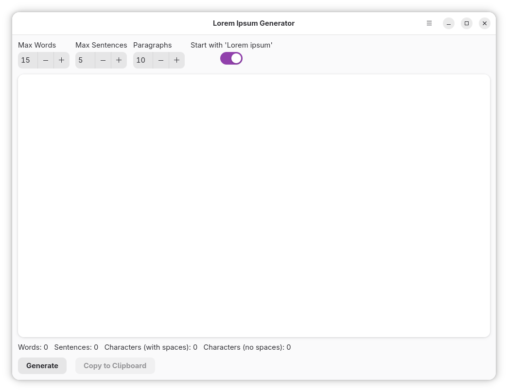
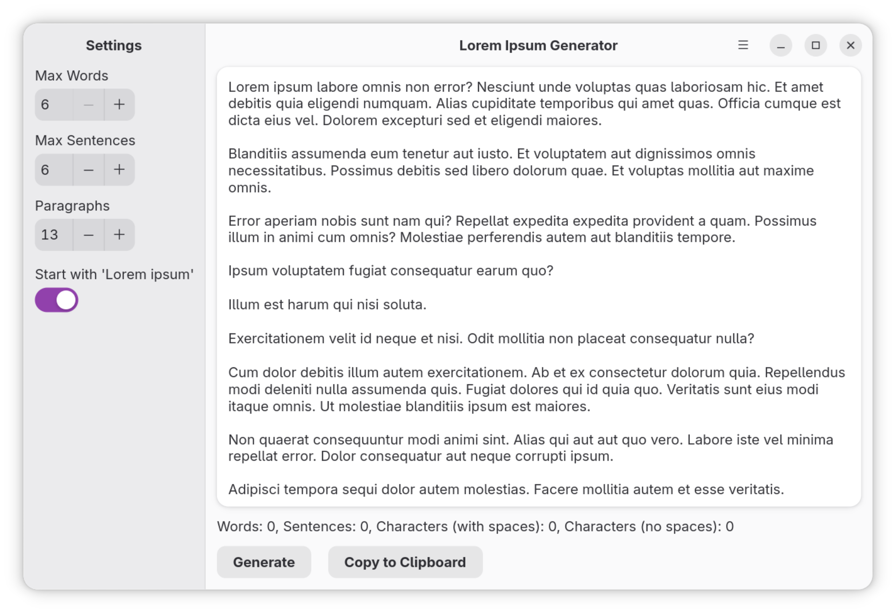
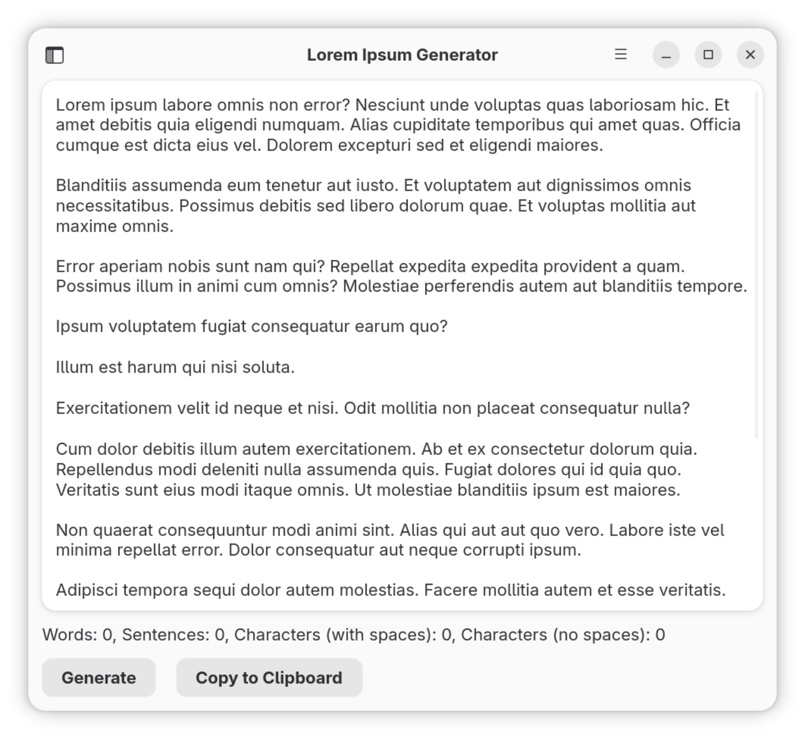

# Lorem Ipsum Generator

A simple and configurable Lorem Ipsum generator built with Rust, GTK4 and Relm4.

## Features

*   **Generate Lorem Ipsum Text:** Create placeholder text for your designs and mockups.
*   **Configurable Output:**
    *   Set the max random number of words.
    *   Set the max random number of sentences.
    *   Set the number of paragraphs.
*   **"Lorem Ipsum" Prefix:** Choose whether to start the generated text with the classic "Lorem ipsum dolor sit amet...".
*   **GUI and CLI Modes:** Use it with a graphical interface or from the command line.
*   **Multilingual Support:** Available in 8 languages including English, Spanish, German, French, Portuguese, Italian, Russian, and Japanese.

## Translations

The application supports multiple languages:

For more information about translations, including how to add new languages, see [TRANSLATIONS.md](TRANSLATIONS.md).

## Usage

### GUI Mode

Simply run the application without any arguments to launch the graphical interface:

```bash
loremgenerator
```

### CLI Mode

Generate Lorem Ipsum text directly from the command line:

```bash
# Basic usage with defaults (starts with "Lorem ipsum", 5 paragraphs, max 4 sentences, max 15 words)
loremgenerator -p=3

# Full customization
loremgenerator -s=1 -p=5 -m=4 -w=15

# Without "Lorem ipsum" prefix
loremgenerator -s=0 -p=2 -m=3 -w=10

# Show help
loremgenerator --help

# Show version
loremgenerator -v
```

#### CLI Options

*   `-s, --start-with-lorem <0|1>` - Start with 'Lorem ipsum' (1 for true, 0 for false) [default: 1]
*   `-p, --paragraphs <NUMBER>` - Number of paragraphs
*   `-m, --ms <NUMBER>` - Maximum sentences per paragraph
*   `-w, --max-words <NUMBER>` - Maximum words per sentence
*   `-v, --version` - Print version
*   `-h, --help` - Print help

## License

This project is licensed under the MIT License - see the [LICENSE](LICENSE) file for details.


## Screenshots

<a href="screenshots/screenshot01.png"></a>
<a href="screenshots/screenshot02.png"></a>
<a href="screenshots/screenshot03.png"></a>

## Installation sources
<a href="https://github.com/XRayAdams/loremgenerator-rs/releases">

</a>

### From Snap Store

[](https://snapcraft.io/loremgenerator)

### AUR manual installation

1. Download the latest `.pkg.tar.zst` package from the project's GitHub releases page.
2. Open a terminal and navigate to the directory where you downloaded the file.
3. Install the package using the following command:

   ```bash
   sudo pacman -U [name-of-the-package].pkg.tar.zst
   ```

Replace `[name-of-the-package].pkg.tar.zst` with the actual file name.

### DEB manual installation

1. Download the latest `.deb` package from the project's GitHub releases page.
2. Open a terminal and navigate to the directory where you downloaded the file.
3. Install the package using the following command:

   ```bash
   sudo apt install [name-of-the-package].deb
   ```

### RPM (Manual Installation)

1. Download the latest `.rpm` package from the project's GitHub releases page or your distribution's package repository.
2. Open a terminal and navigate to the directory where you downloaded the file.
3. Install the package using the following command:

    ```bash
    sudo dnf install [name-of-the-package].rpm
    # or, for openSUSE:
    sudo zypper install [name-of-the-package].rpm
    # or, for older systems:
    sudo rpm -i [name-of-the-package].rpm
    ```

Replace `[name-of-the-package].rpm` with the actual file name.

